<center><h1>第4章  复杂网络与图论模型</h1></center>

> 内容：@若冰（马世拓）
> 
> 审稿：@邢硕
> 
> 排版&校对：@若冰

这一章我们主要介绍复杂网络与图论模型。图论模型不同于以前我们印象中的平面几何图，图论模型的边与点往往只是描述一种拓扑关系，所以并不能用传统平面几何的视角去定义复杂网络。复杂网络的研究领域很广，并且虽然复杂网络和图论二者研究对象相同，但它们探讨的实际上是一个对象的不同方面。我们更多的是做图论模型，会介绍几个经典的问题及其解决算法。本章主要涉及到的知识点有：
- 复杂网络的研究对象
- 最短路径问题
- 最小生成树问题
- 网络最大流问题
- TSP问题和VRP问题
> 注意：本章内容与前面的整数规划也经常会联合在一起考察，并且后面的群体智能算法也在图论中有典型应用。在TSP问题和VRP问题中我们就可能会用到后面第九章讲到的进化计算与群体智能算法。

## 4.1  复杂网络概念与理论
复杂网络与图论，听起来可能有点复杂，其实它们都是研究事物之间关系的好工具。你可以把“网络”想象成一群人和他们之间的朋友关系，或者电脑之间的连接线。而“图论”呢，就是用数学和图形的方式来研究这些关系。比如说，你想知道在一群朋友中，谁是最受欢迎的人，或者在一个复杂的电脑网络中，哪部分是最关键的。这时候，复杂网络与图论就能帮上大忙了。它们能帮你理清这些关系，找到重要的节点或者路径，让你更好地理解和利用这些网络。简而言之，复杂网络与图论就是帮助我们分析和理解复杂关系的好帮手。
### 4.1.1  复杂网络中的基本概念
复杂网络与图论通过节点和边的数学结构，自然地描述了实体间的关系和相互作用。它不仅能处理线性关系，还能捕捉非线性和复杂相互作用。例如，在社交网络分析中，图论可用来识别社区结构、评估影响力和推荐潜在联系。图论还能有效处理不确定性。利用概率图模型和随机过程，我们可以在图论框架下对不确定性进行建模和分析。这使得图论成为解决现实世界问题的理想工具，如网络可靠性和风险评估。


图论图并不侧重几何量与几何关系，更侧重节点之间逻辑层面的关联关系,是从欧几里得空间到非欧几里得空间的扩展。图论的研究最早起源于欧拉提出的哥尼斯堡七桥问题，也就是能否一笔画走完，自此对图形的研究不再只是单纯考虑其几何关系而是更多地考察拓扑特性。图论图实际上就是一个复杂网络，它同样具有节点、边，分为有向图和无向图。

在化学领域，图论发挥着至关重要的作用。想象一下，分子中的原子就像图中的节点，而原子之间的化学键则如同图中的边。图论可以帮助化学家们更直观地理解分子结构，例如通过构建分子的拓扑关系模型，分析分子内部的连接方式和稳定性。这就像我们用地图来理解和规划城市结构一样，图论帮助我们揭示分子内部的奥秘。

在社会科学领域，图论同样大显身手。社交网络，就像是一张巨大的关系网，每个人都是一个节点，人与人之间的联系就是边。图论可以帮助我们分析社交网络中的关系模式，比如谁是社交网络中的关键人物，信息的传播路径是怎样的。这就像我们用网络图来解析人际关系一样，图论帮助我们更好地理解和预测社会现象。

推荐系统，看似复杂，其实也可以从图论的角度进行研究。想象一下，每个物品或服务都是一个节点，而用户对物品的喜好或购买记录就是边。图论可以帮助我们找到物品之间的相似性，从而为用户推荐他们可能感兴趣的物品。这就像我们用图来找到相似的电影或音乐一样，图论让推荐系统更加智能和精准。

计算机网络，作为现代信息社会的基石，也离不开图论的建模。在网络中，每台计算机或设备都可以看作是一个节点，它们之间的连接就是边。图论可以帮助我们分析网络的拓扑结构，优化数据的传输路径，提高网络的稳定性和效率。这就像我们用图来规划交通网络一样，图论确保计算机网络能够高效、稳定地运行。

在图论中，图是由节点和边组成的。节点就像是地图上的城市或者地标，代表着某个具体的事物或对象。而边则像是连接城市的道路，代表着节点之间的关系或连接。你可以想象一个社交网络图，每个用户是一个节点，而用户之间的好友关系就是边。

无向图和有向图是图的两种基本类型。在无向图中，边没有方向，就像一条普通的道路，你可以从A地到B地，也可以从B地到A地。而在有向图中，边是有方向的，就像一条单行道，你只能按照箭头指示的方向行驶。例如，在交通网络中，单行道就是有向边的一个例子。

节点的度是图论中的一个重要概念，它表示与该节点相连的边的数量。在无向图中，节点的度就是与其相连的边数。而在有向图中，节点的度又分为入度和出度。入度是指指向该节点的边的数量，就像你收到多少条消息；出度则是从该节点指出的边的数量，就像你发出了多少条消息。通过这些度的概念，我们可以更好地理解节点在图中的重要性和角色。


欧拉回路是图论研究中最早的相关问题之一。如果图G（有向图或者无向图）中所有边一次仅且一次行遍所有顶点的通路称作欧拉通路；如果图G中所有边一次仅且一次行遍所有顶点的回路称作欧拉回路。

判断图是否存在欧拉回路的方法也很简单，对于有向图而言图连通，所有的顶点出度=入度；对于无向图而言，图连通，所有顶点都是偶数度。

欧拉回路是不重复遍历边，而哈密顿回路的要求更加严苛一些，需要不重复遍历节点。对于哈密顿回路而言，这是数学、拓扑学、计算机科学领域研究十分火热的一个话题。图G的一个回路,若它通过图的每一个节点一次,且仅一次,就是哈密顿回路，存在哈密顿回路的图就是哈密顿图。关于图存在哈密顿回路的充分必要条件，很不幸，目前学界还没有找到。
### 4.1.2  复杂网络中的统计指标
复杂网络学者在考虑网络的时候，往往只关心节点之间有没有边相连，至于节点到底在什么位置，以及具体的几何关系等都是他们不在意的。在这里，他们把网络不依赖于图具体的几何位置与几何形态的性质叫做网络的拓扑性质，相应的结构叫做网络的拓扑结构。那么，什么样的拓扑结构比较适合用来描述真实的系统呢？两百多年来，这个问题的研究经历了三个阶段。在最初的一百多年里，数学家们认为真实系统各因素之间的关系可以用一些规则的结构表示，如最近邻环网；到了二十世纪五十年代末，数学家们想出了一种新的构造网络的方法，在这种方法下，两个节点之间连边与否不再是确定的事情，而是根据一个概率决定，数学家把这样生成的网络叫做随机网络；直到最近几年，由于计算机数据处理和运算能力的飞速发展，科学家们发现大量的真实网络既不是规则网络，也不是随机网络，而是具有与前两者皆不同的统计特征的网络。这样的一些网络被科学家们叫做复杂网络（Complex Networks），对于它们的研究标志着第三阶段的到来。

下面我们介绍图论当中一些基本概念：

- 连通分支：连通分支是一个图论中的概念。在一张图中，有时候一些节点可以通过一些边相互连接，形成一个“团”。这些相互连接的节点和边就构成了一个连通分支。简单来说，连通分支就是图中所有能够相互到达的节点的集合。如果一个图里所有的节点都属于同一个连通分支，那么这个图就被称为连通图；反之，如果图中有多个连通分支，那么这个图就是非连通图。

- 聚类系数（Clustering Coefficient）：聚类系数是图论中用来衡量一个图中节点聚集程度的指标。它计算的是图中每个节点的邻居节点之间实际存在的边数与可能存在的最大边数之间的比值。公式如下：

$$ \text{Clustering Coefficient of Node } i = \frac{\text{Number of Edges Among Neighbors of Node } i}{\text{Maximum Possible Number of Edges Among Neighbors of Node } i} $$

举个例子，假设一个节点有3个邻居节点，那么这3个邻居节点之间最多可能有3条边（每个节点与其他两个节点都相连）。如果这3个邻居节点之间实际上只有2条边，那么这个节点的聚类系数就是2/3。整个图的聚类系数通常是所有节点聚类系数的平均值。聚类系数越高，说明图中的节点越倾向于形成紧密的团簇。

复杂网络本质上只需要对点与点之间的连接关系做描述就可以了，比如一条边是从哪个点到哪个点这样的关系。如果读者朋友学过数据结构，应该知道一个网络图在数据结构中可以用邻接表、邻接矩阵、十字链表等形式表示。而在这些数据结构中，以邻接表和邻接矩阵最为重要。邻接表的每一行表示一个节点，每一列表示一条边，每一项表示以该节点为端点的边权值是多少；而邻接矩阵的每一行每一列都是一个节点，矩阵中的第(i,j)项就表示节点i与节点j之间是否有边连接，如果有，这个边的权重是多少。

- 度分布：大多数实际网络中的节点的度是满足一定的概率分布的。定义P(K)为网络中度为k的节点在整个网络中所占的比例。
- 规则网络:由于每个节点具有相同的度，所以其度分布集中在一个单一尖峰上，是一种Delta分布。
- 完全随机网络:度分布具有Poisson分布的形式，每一条边的出现概率是相等的，大多教节点的度是基本相同的，并接近于网络平均度k，远离峰值k，度分布则按指数形式急剧下降。把这类网络称为均匀网络
- 无标度网络: 具有幂指数形式的度分布。所谓无标度是指一个概率分布函数F(~)对于任意给定常数a存在常数b使得F(x)满足F(ax)=bF(x)。幂律分布是唯一满足无标度条件的概率分布函数。许多实际大规模无标度网络，其幂指数通常为2<Y<3，绝大多数节点的度相对很低，也存在少量度值相对很高的节点(称为hub)，把这类网络称为非均匀网络 (异质网络)。
- 指数度分布网络: $P(k) = e^{-k/r}$， 式中r > 0为一常数。
- 累计度分布：可以用累积度分布函数来描述度的分布情况，它与度分布的关系为
$$
P_k=\sum_{x=k}^{\inf} P(x)
$$
它表示度不小于k的节点的概率分布。
若度分布为幂律分布$P(k)=k^{-\gamma}$，则相应的累计度分布函数符合幂指数为$\gamma-1$的幂律分布
若度分布为指数分布，则相应的累积度分布函数符合同指数的指数分布
- 网络的直径和平均距离：网络中的两节点vi和vj之间经历边数最少的一条简单路径(经历的边各不相同)，称为测地线。测地线的边数dij称为两节点vi和vj之间的距离 (或叫测地线距离)。1/dij称为节点和之间的效率，记为eij。通常效率用来度量节点间的信息传递速度。当和之间没有路径连通时，dij = 而Sj = 0，所以效率更适合度量非全连通网络.
- 网络的直径D定位为所有距离dij中的最大值
- 平均距离(特征路径长度)L定义为所有节点对之间距离的平均值，它描述了网络中节点间的平均分离程度，即网络有多小，计算公式为
$$
L=\frac{1}{N^2}\sum{i=1}^N \sum_{j=1}^N d_{ij}
$$
对于无向简单图来说，dij=dij且di=0，则上式可简化为
$$
L=\frac{2}{N(N+1)}\sum{i=1}^N \sum_{j=1+i}^N d_{ij}
$$
很多实际网络虽然节点数巨大，但平均距离却小得惊人，这就是所谓的小世界效应。

- 集聚系数：集聚系数用以捕获给定节点的邻居节点之间的连接程度。节点的集聚系数定义为：设节点vi和ki个节点直接连接，那么对于无向网络来说，这ki个节点间可能存在的最大边数为；ki(ki-1)/2,而实际存在的边数为M;,由此我们定义$C_i=2M_i/[k_i(k_i-1)]$为节点Vi的集聚系数。

对于有向网络来说，这k;个节点间可能存在的最大弧数为$k_i(k_i-1)$,此时v的集聚系数$C_i=M_i/[k_i(k_i-1)]$。将该集聚系数对整个网络作平均，可得网络的平均集聚系数为$\bar{C}=\frac{1}{N} \sum_{i=1}^N C_i$
显然，O≤C≤1。当C=0,所以节点都是孤立节点，没有边连接。当C =1时，网络为所有节点两两之间都有边连接的完全图。

- 网络密度
网络密度指的是一个网络中各节点之间联络的紧密程度。网络G的网络密度d(G)定义为
$$d(G)=2M/[N(N-1)]$$
式中，M为网络中实际拥有的连接数，N为网络节点数。
网络密度的取值范围为[0,1],当网络内部完全连通时，网络密度为1,而实际网络的密度通常远小于1,实际网络中能够发现的最大
密度值是0.5。
- 度中心性：度中心性分为节点度中心性和网络度中心性。前者指的是节点在其与之直接相连的邻居节点当中的中心程度，而后者则侧重节点在整个网络的中心程度，表征的是整个网络的集中或集权程度，即整个网络围绕一个节点或一组节点来组织运行的程度。节点V的度中心性Cp(v;)定义为
$$Cp(v₁)=ki/(N-1)$$
- 介数中心性：介数中心性分为节点介数中心性和网络介数中心性。节点V的介数中心性Cg(v;)定义为
$$CB(v₁)=2Bi/[(N-2)(N-1)]$$
与度中心性类似，可得到H=N-1(也是星型网络，中心节点的介数中心性为1,其它节点的介数中心性为0)。
- 接近度中心性：对于连通图来说，节点v的接近度中心性Cc(v;)定义为
$Cc(u)=(N-1)/E;=tj≠d;$
- 特征向量中心性：对于图的邻接矩阵进行特征值分解：
$Ax =λa$


## 4.2  图论算法：遍历，二分图与最小生成树
### 4.2.1  图的遍历算法
图的遍历，简单来说，就是走遍图中的所有节点，确保不遗漏任何一个。想象一下，你手里有一张地图，上面有很多城市，城市之间有道路相连。遍历这张地图，就是要你走遍所有的城市，并且每座城市只去一次。这就像是一个探险游戏，你要按照某种规则，一步步探索地图上的每一个角落。

图遍历有多种方法，比如深度优先遍历和广度优先遍历。深度优先遍历就像是探险家从某个城市出发，一直沿着一条路走，直到走到不能再走为止，然后再返回来换一条路继续走。而广度优先遍历则更像是探险家先走遍所有的邻居城市，然后再去更远的地方。这些遍历方法在计算机科学中非常有用，因为它可以帮助我们了解图的结构，找到图中的特定信息，比如两个节点之间的最短路径等。在实际生活中，图的遍历也被广泛应用于社交网络分析、地图导航、电路设计等领域。

刚刚说到，图的遍历有两种方法，即深度优先和广度优先。图的深度优先遍历是一种用于图的遍历的算法思想，其基本思想是从图的某一顶点出发，沿着图的边尽可能深地搜索图的分支，直到该分支的末端，然后回溯到前一个顶点，再继续搜索下一个分支。这种遍历方式类似于树的先序遍历，总是优先探索当前顶点的未访问过的邻居顶点，直到所有的邻居顶点都被访问过，才返回上一层顶点继续遍历。深度优先遍历可以帮助我们找到图中的连通分量、生成树等结构，是图论和计算机科学中的重要算法之一。

图的遍历是计算机领域中的一个重要概念，主要有两种方法：深度优先遍历和广度优先遍历。本文将重点介绍深度优先遍历的原理、应用和特点，以便新手能够更容易地理解这一算法。

深度优先遍历是一种从图的某一顶点出发，沿着图的边尽可能深入地搜索图的分支，直到该分支的末端，然后回溯到前一个顶点，再继续搜索下一个分支的算法。这种遍历方式与树的先序遍历类似，总是优先探索当前顶点的未访问过的邻居顶点。当所有邻居顶点都被访问过后，算法返回上一层顶点继续遍历。

深度优先遍历的过程可以用以下几个步骤来描述：

1. 选择一个起始顶点，将其标记为已访问。
2. 访问一个与当前顶点相邻的未访问过的顶点，将其标记为已访问，并将其作为新的当前顶点。
3. 如果当前顶点没有未访问过的相邻顶点，回溯到上一个顶点，并将该顶点的相邻顶点重新标记为未访问。
4. 重复步骤2和3，直到所有顶点都被访问过。

为了帮助你们更好地理解这一概念，让我们通过一个生动的例子来说明。想象一下，你正在一个迷宫中探险，深度优先遍历就像是你的探险策略。你从入口开始，选择一条路径走下去，直到你到达一个死胡同或迷宫的尽头。然后，你返回到上一个分叉点，尝试另一条路径。你不断重复这个过程，直到你探索了迷宫的每一个角落。

深度优先遍历的应用非常广泛。在计算机科学中，它可以用于解决路径搜索问题，如在互联网中寻找数据包从源到目的地的最短路径。在社会科学中，深度优先遍历可以帮助我们分析社交网络的结构，了解信息是如何在网络中传播的。在生物学中，它可以用来研究生态系统中的食物网，了解物种之间的相互依赖关系。

我们可以看到下面的例子，如图所示：
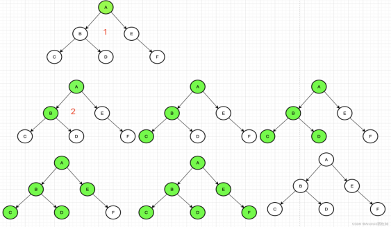

在数学建模中，理解和掌握图搜索算法是至关重要的。今天，我们将专注于深度优先搜索（DFS）和广度优先搜索（BFS）这两种基本的图遍历技术。这些方法在解决从迷宫导航到社交网络分析等各种问题中都有广泛应用。

在Python中，实现DFS的直观方式是使用递归。这种方法涉及定义一个递归函数，该函数接受一个顶点作为参数，并访问该顶点，然后对每个未访问的邻接顶点递归调用自身。这种方法不需要额外的库，代码简洁且易于理解。

在Python中，我们可以使用递归或栈来实现深度优先搜索。递归实现深度优先搜索是最直观的方式。在递归实现中，我们通常会定义一个递归函数，该函数接收一个顶点作为参数，并访问该顶点。然后，它会对该顶点的每个未访问过的邻居顶点调用自身。它的实现不需要使用任何库，可以这样写：
```python
def dfs_recursive(graph, start, visited=None):  
    if visited is None:  
        visited = set()  
    visited.add(start)  
    print(start)  
    for next_node in graph[start] - visited:  
        dfs_recursive(graph, next_node, visited)  
    return visited
```
使用基于邻接表存储的图进行测试，结果如下：
```python
graph = {  
    'A': {'B', 'C'},  
    'B': {'A', 'D', 'E'},  
    'C': {'A', 'F'},  
    'D': {'B'},  
    'E': {'B', 'F'},  
    'F': {'C', 'E'},  
}  
  
print(dfs_recursive(graph, 'A'))
```
所得到的遍历顺序为ACFEBD.

另一种实现深度优先搜索的方法是使用栈。在这种方法中，我们维护一个栈来保存待访问的顶点。我们首先将起始顶点压入栈中，然后进入循环，直到栈为空。在每次循环中，我们弹出栈顶的顶点，并访问它。然后，我们将该顶点的所有未访问过的邻居顶点压入栈中。基于栈的实现如下所示：
```python
def dfs_iterative(graph, start):  
    visited = set()  
    stack = [start]  
      
    while stack:  
        vertex = stack.pop()  
        if vertex not in visited:  
            visited.add(vertex)  
            print(vertex)  
            stack.extend(neighbor for neighbor in graph[vertex] if neighbor not in visited)  
      
    return visited 
```
 
所得到的遍历顺序为ABDEFC.

在两种实现方式中，我们都使用了一个集合visited来跟踪已经访问过的顶点，以避免重复访问。在递归实现中，visited集合是通过参数传递的，而在迭代实现中，它是在函数内部维护的。这里我们可以看到，图的深度优先搜索方式并不唯一。无论是递归还是非递归，只要能正确遍历就是可以的。

图的广度优先遍历（Breadth-First Search, BFS）是一种用于图的遍历的算法，其基本思想是从图的某一顶点出发，先访问该顶点的所有未访问过的邻居顶点，然后再依次访问这些邻居顶点的未访问过的邻居顶点，如此类推，直到所有可达的顶点都被访问过。这种遍历方式类似于树的层次遍历，总是优先访问离起始顶点近的顶点。

我们可以看到下面的例子：
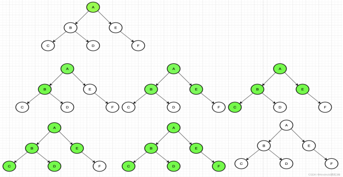
BFS从起始顶点开始，访问所有直接相邻的未访问顶点，然后对这些顶点的邻居重复此过程，直到图中所有顶点都被访问。BFS可以通过递归或队列来实现。使用队列的实现方式更加直观，我们可以将待访问的顶点放入队列中，并在每一步中处理队列的前端顶点。

在Python中我们可以通过递归或队列实现广度优先搜索。在广度优先搜索中，我们首先访问起始顶点，然后访问所有相邻的未访问过的顶点，然后对每个这样的顶点，再访问它们的相邻的未访问过的顶点，如此进行下去，直到所有顶点都被访问过。这种策略可以用两种常见的方式来实现：递归和队列。

队列用于存储待访问的顶点。当我们访问一个顶点时，我们将它的所有未访问过的邻居加入队列的末尾。然后，我们不断从队列的头部取出顶点进行访问，直到队列为空。以下是一个使用队列实现广度优先搜索的示例：
```python
def BFS(graph, s):
    queue = []
    queue.append(s)
    seen = set()
    seen.add(s)
    while len(queue) > 0:
        vertex = queue.pop(0)
        nodes = graph[vertex]
        for node in nodes:
            if node not in seen:
                queue.append(node)
                seen.add(node)
        print(vertex)
```
同样使用邻接表进行测试：
```python
graph = {
        'a' : ['b', 'c'],
        'b' : ['a', 'c', 'd'],
        'c' : ['a','b', 'd','e'],
        'd' : ['b' , 'c', 'e', 'f'],
        'e' : ['c', 'd'],
        'f' : ['d']
        }
```
得到的遍历顺序为abcdef.


广度优先搜索通常使用队列来实现，但也可以使用递归来实现。递归实现的一个常见方法是使用层序遍历，也就是每层只访问一次。为此，我们需要一个额外的数据结构来存储每层的顶点。以下是一个使用递归实现广度优先搜索的示例：
```python
def bfs_recursive(graph, root):  
    nodes=list(graph.keys())
    visited = set()  
    levels = [[root]]  # 初始化层级列表，第一层只有一个根节点  
    next_level=[]
    def process_level(level):  
        if not level:  
            return  # 当前层级为空，返回上一层  
        for node in level:  
            if node not in visited:  
                visited.add(node)  
                print(node, end=" ")  
                # 将未访问的邻居加入下一层级的列表  
                next_level.extend(neighbour for neighbour in graph[node] if neighbour not in visited)  
  
        # 如果还有下一层级，递归处理  
        if next_level:  
            if set(nodes)==visited:
                return
            levels.append(next_level)
            process_level(next_level)  
    # 递归处理每一层  
    while levels:  
        process_level(levels.pop(0))  

  
bfs_recursive(graph, 'a')  # 输出: A B C D E F
```
process_level函数会处理当前层级的节点，并将下一层级的节点添加到levels列表中。然后，如果levels列表不为空，它会继续处理下一层级。这样，递归调用就会按照广度优先的顺序处理所有节点，而不会导致无限递归。

networkx工具包进行图遍历时使用的是bfs_edges函数与dfs_edges函数。例如，我们看到下面的代码：
```python
import networkx as nx  # 导入 NetworkX 工具包
G = nx.Graph()  # 创建：空的 无向图
G.add_weighted_edges_from([(1,2,50),(1,3,60),(2,4,65),(2,5,40),(3,4,52),
                (3,7,45),(4,5,50),(4,6,30),(4,7,42),(5,6,70)])  # 向图中添加多条赋权边: (node1,node2,weight)
list(nx.dfs_edges(G,1))
list(nx.bfs_edges(G,1))
```
它分别调用了dfs_edges和bfs_edges函数来展示从节点1开始的深度优先搜索（DFS）和广度优先搜索（BFS）的边遍历顺序。dfs_edges和bfs_edges用于生成DFS和BFS遍历的边序列，而dfs_tree和bfs_tree则用于构建DFS和BFS遍历的树状结构。这些函数对于理解和分析图的结构和性质非常有用。

### 4.2.2  二分图最大匹配
二分图又叫二部图，是图论中的一种特殊模型。假设S=(V,E)是一个无向图。如果顶点V可分割为两个互不相交的子集(A,B)，并且图中的每条边(i,j)所关联的两个顶点i和j分别属于这两个不同的顶点集(i in A,j in B)，就可以称图S为一个二分图。简单来说，就是顶点集V可分割为两个互不相交的子集，并且图中每条边依附的两个顶点都分属于这两个互不相交的子集，两个子集内的顶点不相邻。

在二分图S中，一个子图M如果构成其边集的任意两条边都不依附于同一个顶点，则M被称为一个匹配。这意味着在匹配中，每条边的两个端点分别属于二分图的两个不同集合，且任意两条边不会共享任何一个顶点。匹配是图论中一个重要的概念，用于研究图中节点之间的配对关系。


极大匹配是指在给定的二分图中，已经找不到更多的边可以添加到匹配中，使得每条边都满足匹配的条件。换句话说，极大匹配是一个无法再通过增加未匹配边来扩大的匹配。而最大匹配则是指在所有可能的极大匹配中，边数达到最大的一个。最大匹配是二分图中匹配边数的上限，它衡量了图中可以形成的最大规模的匹配。

如果一个匹配中包含了图中所有的顶点，即每个顶点都至少与匹配中的一条边相关联，那么这样的匹配被称为完全匹配或完备匹配。完全匹配意味着图中的每个节点都成功地与其他节点建立了配对关系。需要注意的是，完全匹配一定是极大匹配，因为已经没有任何未匹配的边可以加入。然而，并非所有的极大匹配都能达到完全匹配的状态，因为有可能存在一些顶点在极大匹配中没有被覆盖。

匹配、极大匹配、最大匹配和完全匹配是图论中逐渐递进的概念。它们用于描述和分析二分图中节点之间的配对关系，以及这种关系的规模和性质。通过寻找最大匹配和完全匹配，我们可以更好地理解图的结构和特性。二分图匹配的本质是一个指派问题，还记得我们在第3章中提到的吗，这类问题可以使用匈牙利算法解。

对于二分图的判断方法最常见的是染色法，就是对每一个点进行染色操作，只用黑白两种颜色，能不能使所有的点都染上了色且相邻两个点的颜色不同。如果能则是二分图。

KM算法，全称Kuhn-Munkres算法，也被称为匈牙利算法的一种扩展，主要用于解决二分图的最大权重匹配问题。在二分图的最大权重匹配问题中，给定一个二分图，其中图的边带有权重，目标是找到一种匹配方式，使得所有匹配边的权重之和最大。

KM算法的基本思想是通过给每个顶点一个标号（称为顶标），然后不断寻找增广路进行增广，直到找不到增广路为止。这里的增广路指的是一条从左侧未匹配点出发，到右侧未匹配点结束的路径，路径中的边交替出现未匹配边和已匹配边。

以下是KM算法的主要步骤：
1. 初始化：首先，给二分图的左侧每个顶点一个顶标，这个顶标通常初始化为与其相连的所有边中的最大权重；给右侧每个顶点一个顶标，这个顶标初始化为0。同时，初始化一个匹配矩阵，用于记录当前的匹配情况。
2. 寻找增广路：从左侧未匹配的顶点开始，尝试寻找增广路。在寻找过程中，对于每一条边，如果满足左侧顶点的顶标加上右侧顶点的顶标大于等于边的权重，那么这条边是可以走的。如果找到了一条增广路，那么进行增广操作，更新匹配矩阵，并尝试继续寻找增广路。
3. 调整顶标：如果找不到增广路，那么需要进行顶标调整。调整的原则是，对于在增广路中的左侧顶点，减小其顶标；对于不在增广路中的左侧顶点，增大其顶标。同样，对于在增广路中的右侧顶点，增大其顶标；对于不在增广路中的右侧顶点，保持其顶标不变。调整顶标的目的是为了让更多的边满足可以走的条件，从而可能找到新的增广路。
4. 重复步骤2和3：重复寻找增广路和调整顶标的步骤，直到找不到增广路为止。此时，当前的匹配就是二分图的最大权重匹配。

KM算法的时间复杂度主要取决于寻找增广路和调整顶标的次数，一般来说，其时间复杂度为O(n^3)，其中n为二分图中顶点的数量。虽然KM算法的时间复杂度较高，但由于它能够解决带有权重的二分图匹配问题，因此在一些实际问题中仍然具有广泛的应用。
KM算法的实现如下：

```python

"""
KM算法
复杂度O(E*V*V)
"""
a = -float('inf')
# a = 5
graph = [
    [4, 2, 6, a, a],
    [2, 6, a, 6, 3],
    [a, 3, 6, a, a],
    [a, 8, 2, a, a],
    [a, a, a, 3, 1]
]
label_left, label_right = [max(g) for g in graph], [0 for _ in graph]
S, T = {}, {}

visited_left = [False for _ in graph]
visited_right = [False for _ in graph]
slack_right = [float('inf') for _ in graph]
def find_path(i, visited_left, visited_right, slack_right):
    visited_left[i] = True
    for j, match_weight in enumerate(graph[i]):
        if visited_right[j]:
            continue
        gap = label_left[i] + label_right[j] - match_weight
        if gap == 0:
            visited_right[j] = True
            if j not in T or find_path(T[j], visited_left, visited_right, slack_right):
                T[j] = i
                S[i] = j
                return True
        else:
            slack_right[j] = min(slack_right[j], gap)
    return False
def KM():
    m = len(graph)
    for i in range(m):
        # 重置辅助变量
        slack_right = [float('inf') for _ in range(m)]
        while True:
            visited_left = [False for _ in graph]
            visited_right = [False for _ in graph]
            if find_path(i,visited_left,visited_right, slack_right):
                break
            d = float('inf')
            for j, slack in enumerate(slack_right):
                if not visited_right[j] and slack < d:
                    d = slack
            for k in range(m):
                if visited_left[k]:
                    label_left[k] -= d
                if visited_right[k]:
                    label_right[k] += d
    return S, T
KM()
print(S)
{0: 0, 1: 3, 2: 2, 3: 1, 4: 4}

```

### 4.2.3  最小生成树
树是一种抽象数据类型（ADT）或是实现这种抽象数据类型的数据结构，用来模拟具有树状结构性质的数据集合。在树结构中，每个节点有零个或多个子节点。根节点是树中的第一个节点，它没有父节点。除了根节点外，每个节点有且仅有一个父节点。树的深度是从根节点到最远叶子节点的最长路径上的节点数。

树、图和生成树之间存在密切关系。树是图的子集，其中任何两个节点之间恰好存在一条路径。换句话说，树是一个无环连通图。生成树则是图的一个子集，它包含图的所有节点且是一个树，即它也是一个无环连通图。因此，每个连通图都至少有一个生成树。生成树在许多算法中都有应用，如最小生成树算法，用于在网络中找到总权重最小的树形结构，使得所有节点都相互连通。

树的基本要素包括节点、边、权值、父节点、根节点和叶子节点。节点是树中的基本单位，可以看作是数据的存储单元。边是连接两个节点的路径，表示节点之间的关系。权值通常与边相关联，表示这条边的某种度量或代价，如距离或成本。在树中，每个节点通常有一个或多个父节点（除了根节点），根节点是树中没有父节点的节点，而叶子节点是没有子节点的节点。

最小生成树（Minimum Spanning Tree, MST）是图论中的一个概念，特指在一个连通的无向图中，包含所有顶点且边的权值之和最小的树。换句话说，最小生成树是原图的一个子集，构成了一棵树，并且这棵树的所有边的权值之和最小，同时保证了图中的所有顶点都被包含在内。最小生成树在计算机科学、网络优化等领域有着广泛的应用，常见的求解算法有Kruskal算法和Prim算法。

Prim算法从任意一个顶点开始，每次选择一个与当前顶点集最近的一个顶点，并将两顶点之间的边加入到树中。Prim算法在找当前最近顶点时使用到了贪婪算法。可在加权连通图里搜索最小生成树，由此算法搜索到的边子集所构成的树中，不但包括了连通图里的所有顶点，且其所有边的权值之和亦为最小。如图所示：
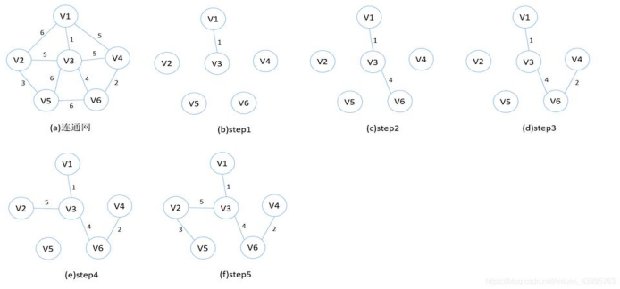
```python
import heapq  
  
def prim(graph, start):  
    mst = {start: []}  # 最小生成树，初始只包含起始节点  
    visited = {start}  # 已访问的节点集合  
    edges = [(cost, start, to) for to, cost in graph[start].items()]  # 起始节点的边加入堆中  
    heapq.heapify(edges)  # 初始化堆  
  
    while edges:  
        cost, frm, to = heapq.heappop(edges)  # 弹出权重最小的边  
        if to not in visited:  
            visited.add(to)  # 标记节点为已访问  
            mst[to] = []  # 在MST中添加新节点  
            mst[frm].append((cost, to))  # 添加边到MST  
            mst[to].append((cost, frm))  # 由于是无向图，双向添加边  
            for to_next, cost2 in graph[to].items():  
                if to_next not in visited:  
                    heapq.heappush(edges, (cost2, to, to_next))  # 添加相邻节点的边到堆中  
  
    return mst  # 返回最小生成树  
  
# 示例图的邻接表表示  
graph = {  
    'A': {'B': 1, 'C': 4},  
    'B': {'A': 1, 'C': 2, 'D': 5},  
    'C': {'A': 4, 'B': 2, 'D': 1},  
    'D': {'B': 5, 'C': 1}  
}  
  
# 运行Prim算法  
mst = prim(graph, 'A')  
print("Minimum Spanning Tree:", mst)
Minimum Spanning Tree: {'A': [(1, 'B')], 'B': [(1, 'A'), (2, 'C')], 'C': [(2, 'B'), (1, 'D')], 'D': [(1, 'C')]}
```
Kruskal算法不同于Prim的从一点出发，它是一种全局的添加方法。将所有边按照权值的大小进行升序排序，然后从小到大一一判断，条件为：如果这个边不会与之前选择的所有边组成回路，就可以作为最小生成树的一部分；反之，舍去。直到具有 n 个顶点的连通网筛选出来 n-1 条边为止。筛选出来的边和所有的顶点构成此连通网的最小生成树。判断是否会产生回路的方法为：在初始状态下给每个顶点赋予不同的标记，对于遍历过程的每条边，其都有两个顶点，判断这两个顶点的标记是否一致，如果一致，说明它们本身就处在一棵树中，如果继续连接就会产生回路；如果不一致，说明它们之间还没有任何关系，可以连接。
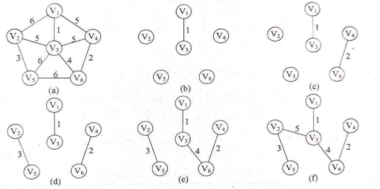
```python

def find(parent, i):  
    if parent[i] != i:  
        parent[i] = find(parent, parent[i])  
    return parent[i]  
  
def union(parent, rank, x, y):  
    root_x = find(parent, x)  
    root_y = find(parent, y)  
    if root_x != root_y:  
        if rank[root_x] > rank[root_y]:  
            parent[root_y] = root_x  
        else:  
            parent[root_x] = root_y  
            if rank[root_x] == rank[root_y]:  
                rank[root_y] += 1  
 
def kruskal(graph):  
    edges = []  
    for u in graph:  
        for v, w in graph[u].items():  
            edges.append((w, u, v))  
    edges.sort()  # Sort the edges by weight  
  
    mst = []  
    parent = {v: v for v in graph}  # Initialize each node as its own set  
    rank = {v: 0 for v in graph}    # Initialize rank for each set  
  
    for weight, u, v in edges:  
        if find(parent, u) != find(parent, v):  # If the nodes are not connected  
            union(parent, rank, u, v)           # Merge the sets  
            mst.append((u, v, weight))          # Add the edge to the MST  
  
    return mst  
  
# Example graph represented as an adjacency list  
graph = {  
    'A': {'B': 1, 'C': 4},  
    'B': {'A': 1, 'C': 2, 'D': 5},  
    'C': {'A': 4, 'B': 2, 'D': 1},  
    'D': {'B': 5, 'C': 1}  
}  
  
# Run the Kruskal algorithm  
mst = kruskal(graph)  
print("Edges in the Minimum Spanning Tree:", mst)
Edges in the Minimum Spanning Tree: [('A', 'B', 1), ('C', 'D', 1), ('B', 'C', 2)]
```
使用networkx实现最小生成树的代码如下：
```python
import matplotlib.pyplot as plt  
import networkx as nx  
  
# 创建带权边的列表  
weighted_edges = [(i, j, weight) for i, j, weight in [  
    (1, 2, 50), (1, 3, 60), (2, 4, 65), (2, 5, 40), (3, 4, 52),  
    (3, 7, 45), (4, 5, 50), (4, 6, 30), (4, 7, 42), (5, 6, 70)  
]]  
  
# 创建无向图并添加边  
def create_and_add_edges(G):  
    G.add_weighted_edges_from(weighted_edges)  
    return G  
  
# 计算最小生成树  
def calculate_mst(G):  
    mst_kruskal = nx.minimum_spanning_tree(G)  
    mst_edges_kruskal = list(nx.tree.minimum_spanning_edges(G, algorithm="kruskal"))  
    mst_prim = list(nx.tree.minimum_spanning_edges(G, algorithm="prim", data=False))  
    return mst_kruskal, mst_edges_kruskal, mst_prim  
  
# 创建图  
G = create_and_add_edges(nx.Graph())  
  
# 计算最小生成树  
mst_kruskal, mst_edges_kruskal, mst_prim = calculate_mst(G)  
  
# 打印节点和边  
print("Nodes of MST (Kruskal):", mst_kruskal.nodes)  
print("Edges of MST (Kruskal):", mst_kruskal.edges)  
print("Sorted Edges of MST (Kruskal):", sorted(mst_kruskal.edges))  
print("MST Edges (Kruskal with weights):", mst_edges_kruskal)  
print("MST Edges (Prim):", mst_prim)  
  
# 指定顶点位置  
pos = {  
    1: (2.5, 10), 2: (0, 5), 3: (7.5, 10), 4: (5, 5),   
    5: (2.5, 0), 6: (7.5, 0), 7: (10, 5)  
}  
  
# 绘制图形  
nx.draw(G, pos, with_labels=True, alpha=0.8, node_color='lightblue', edge_color='gray')  
labels = nx.get_edge_attributes(G, 'weight')  
nx.draw_networkx_edge_labels(G, pos, edge_labels=labels, font_color='red', font_size=12)  
nx.draw_networkx_edges(G, pos, edgelist=mst_kruskal.edges, edge_color='red', width=3, alpha=0.9)  
  
# 显示图形  
plt.axis('off')  # 不显示坐标轴  
plt.show()

```
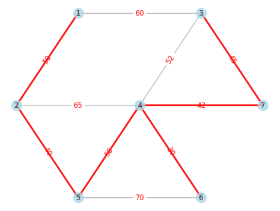

## 4.3  图论算法：最短路径与最大流问题

### 4.3.1  最短路径问题
当我们谈论“最短路径问题”时，可以想象你正在规划一次旅行，希望从起点城市到达终点城市，并且希望整个旅程的距离或时间尽可能短。这就是图论中的最短路径问题，它涉及到在由节点（可以看作城市）和边（可以看作连接城市的道路）组成的网络中，找到从起点到终点的最短路线。解决这类问题的算法有很多，包括Floyd算法、迪杰斯特拉算法、Bellman-Ford算法、A*算法等。

Floyd算法是解决给定的加权图中顶点间的最短路径的一种算法，可以正确处理有向图或负权的最短路径问题，同时也被用于计算有向图的传递闭包。是一种类似于动态规划思想的算法，稠密图效果最佳，边权可正可负。只需要三次循环，但也恰恰是由于它属于循环结构所以Floyd算法适合做节点数量小而且稠密的图，能够一次输出所有节点对之间的最短路径。但请注意，这一方法只能在不存在负权环的情况下使用

下面是Floyd算法的基本执行流程：

1. **初始化**：
   - 对于图中的每一个顶点对(i, j)，如果顶点i和j之间存在一条直接边，则设置距离矩阵D[i][j]为该边的权重；如果不存在直接边，则设置D[i][j]为无穷大（表示这两个顶点之间不可达）。
   - 对于每一个顶点i，设置D[i][i]为0，因为从一个顶点到其自身的距离总是0。
   - 初始化一个路径矩阵P，用于记录最短路径中每个顶点的前驱顶点。在初始化时，如果D[i][j]不是无穷大，则P[i][j]为j；否则，P[i][j]可以设置为一个特殊值，表示没有前驱顶点。

2. **迭代过程**：
   - 对于图中的每一个顶点k，执行以下步骤：
     - 对于每一对顶点对(i, j)，检查是否存在一条通过顶点k的路径，使得从i到j的距离比当前记录的距离更短。这可以通过比较D[i][k] + D[k][j]与D[i][j]来实现。
     - 如果D[i][k] + D[k][j] < D[i][j]，则更新D[i][j]为D[i][k] + D[k][j]，并更新P[i][j]为k，表示在最短路径中，顶点i到顶点j是通过顶点k的。

3. **结果输出**：
   - 在完成所有的迭代后，D矩阵中存储的就是图中所有顶点对之间的最短距离。
   - 如果需要知道从顶点i到顶点j的最短路径上的所有顶点，可以从P矩阵中回溯。从P[i][j]开始，不断查找P[P[i][j]][j]，直到找到起点i或找不到前驱顶点为止。

Floyd算法的时间复杂度为O(n^3)，其中n是图中顶点的数量。虽然它的时间复杂度相对较高，但由于它能够处理带有负权重的图，并且能够找到所有顶点对之间的最短路径，因此在某些应用中仍然非常有用。

```python
# 弗洛伊德算法
def floyd():
    n = len(graph)
    for k in range(n):
        for i in range(n):
            for j in range(n):
                if graph[i][k] + graph[k][j] < graph[i][j]:
                    graph[i][j] = graph[i][k] + graph[k][j]
                    parents[i][j] = parents[k][j]  # 更新父结点

# 打印路径
def print_path(i, j):
    if i != j:
        print_path(i, parents[i][j])
    print(j, end='-->')
我们用一个样例进行测试：
# Data [u, v, cost]
datas = [
    [0, 1, 2],
    [0, 2, 6],
    [0, 3, 4],
    [1, 2, 3],
    [2, 0, 7],
    [2, 3, 1],
    [3, 0, 5],
    [3, 2, 12],
]
n = 4
# 无穷大
inf = 9999999999
# 构图
graph = [[(lambda x: 0 if x[0] == x[1] else inf)([i, j]) for j in range(n)] for i in range(n)]
parents = [[i] * n for i in range(4)]  # 关键地方，i-->j 的父结点初始化都为i
for u, v, c in datas:
    graph[u][v] = c # 因为是有向图，边权只赋给graph[u][v]
    #graph[v][u] = c # 如果是无向图，要加上这条。
floyd()
print('Costs:')
for row in graph:
    for e in row:
        print('∞' if e == inf else e, end='\t')
    print()
print('\nPath:')
for i in range(n):
    for j in range(n):
        print('Path({}-->{}): '.format(i, j), end='')
        print_path(i, j)
        print(' cost:', graph[i][j])
```
得到结果如下图所示：
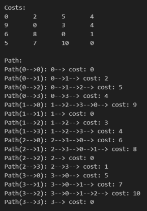

从上图中可以看到，Floyd算法可以把所有节点对之间的最短路径全部打印出来，是一种非常有效的方法。

Dijkstra算法是基于贪心思想实现的最短路径算法，首先把起点到所有点的距离存下来找最短的，然后松弛一次再找出最短的，所谓的松弛操作就是，遍历一遍看通过刚刚找到的距离最短的点作为中转站会不会更近，如果更近了就更新距离，这样把所有的点找遍之后就存下了起点到其他所有点的最短距离。Dijkstra算法是一种典型的单源最短路径算法，用于计算一个节点到其他所有节点的最短路径。主要特点是以起始点为中心向外层层扩展，直到扩展到终点为止。

Dijkstra算法的基本执行流程如下：

1. **初始化**：
   - 设置一个数组`dist[]`，用于存储从起点到每个节点的最短距离。开始时，将起点的距离设为0，其余所有节点的距离设为无穷大（表示它们还没有被找到最短路径）。
   - 创建一个集合`visited`，用于记录已经找到最短路径的节点。开始时，集合为空。

2. **选择未访问的节点中距离最短的节点**：
   - 从所有未访问的节点中选择一个当前距离最短的节点。这通常通过遍历`dist[]`数组来实现，找到距离最小的节点。

3. **标记节点为已访问**：
   - 将选中的节点标记为已访问，并加入`visited`集合中。

4. **更新邻居节点的距离**：
   - 遍历选中节点的所有邻居节点。对于每个邻居节点，如果通过当前节点作为中间节点可以得到更短的距离，则更新`dist[]`数组中对应邻居节点的距离值。

5. **重复步骤2-4**：
   - 重复执行步骤2至步骤4，直到所有节点都被访问过，即`visited`集合包含了所有的节点。

6. **结果输出**：
   - 算法结束时，`dist[]`数组将包含从起点到每个节点的最短距离。

需要注意的是，Dijkstra算法不能处理带有负权重的边，因为负权重可能导致算法陷入无限循环或得到错误的结果。此外，为了更高效地执行步骤2（选择距离最短的节点），通常会使用一个优先队列（如最小堆）来存储未访问的节点及其当前距离，这样可以在O(log n)的时间内选择出距离最短的节点。

在实际应用中，Dijkstra算法常用于解决地图上的最短路径问题、网络路由选择等场景。下面是使用networkx中的最短路径接口调用迪杰斯特拉算法的案例demo

```python

import matplotlib.pyplot as plt # 导入 Matplotlib 工具包
import networkx as nx  # 导入 NetworkX 工具包

G2 = nx.Graph()  # 创建：空的 无向图
G2.add_weighted_edges_from([(1,2,2),(1,3,8),(1,4,1),
                            (2,3,6),(2,5,1),
                            (3,4,7),(3,5,5),(3,6,1),(3,7,2),
                            (4,7,9),
                            (5,6,3),(5,8,2),(5,9,9),
                            (6,7,4),(6,9,6),
                            (7,9,3),(7,10,1),
                            (8,9,7),(8,11,9),
                            (9,10,1),(9,11,2),
                            (10,11,4)])  # 向图中添加多条赋权边: (node1,node2,weight)
# 两个指定顶点之间的最短加权路径
minWPath_v1_v11 = nx.dijkstra_path(G2, source=1, target=11)  # 顶点 0 到 顶点 3 的最短加权路径
print("顶点 v1 到 顶点 v11 的最短加权路径: ", minWPath_v1_v11)
# 两个指定顶点之间的最短加权路径的长度
lMinWPath_v1_v11 = nx.dijkstra_path_length(G2, source=1, target=11)  #最短加权路径长度
print("顶点 v1 到 顶点 v11 的最短加权路径长度: ", lMinWPath_v1_v11)
pos = nx.spring_layout(G2)  # 用 FR算法排列节点
nx.draw(G2, pos, with_labels=True, alpha=0.5)
labels = nx.get_edge_attributes(G2,'weight')
nx.draw_networkx_edge_labels(G2, pos, edge_labels = labels)
plt.show()
```

另一个demo如下：
```python
import pandas as pd
import matplotlib.pyplot as plt # 导入 Matplotlib 工具包
import networkx as nx  # 导入 NetworkX 工具包

# 问题 1：城市间机票价格问题（司守奎，数学建模算法与应用，P41，例4.1）
# # 从Pandas数据格式（顶点邻接矩阵）创建 NetworkX 图
# # from_pandas_adjacency(df, create_using=None) # 邻接矩阵，n行*n列，矩阵数据表示权重
dfAdj = pd.DataFrame([[0, 50, 0, 40, 25, 10],  # 0 表示不邻接，
                      [50, 0, 15, 20, 0, 25],
                      [0, 15, 0, 10, 20, 0],
                      [40, 20, 10, 0, 10, 25],
                      [25, 0, 20, 10, 0 ,55],
                      [10, 25, 0, 25, 55, 0]])
G1 = nx.from_pandas_adjacency(dfAdj)  # 由 pandas 顶点邻接矩阵 创建 NetworkX 图
# 计算最短路径：注意最短路径与最短加权路径的不同
# 两个指定顶点之间的最短路径
minPath03 = nx.shortest_path(G1, source=0, target=3)  # 顶点 0 到 顶点 3 的最短路径
lMinPath03 = nx.shortest_path_length(G1, source=0, target=3)  #最短路径长度
print("顶点 0 到 3 的最短路径为：{}，最短路径长度为：{}".format(minPath03, lMinPath03))
# 两个指定顶点之间的最短加权路径
minWPath03 = nx.bellman_ford_path(G1, source=0, target=3)  # 顶点 0 到 顶点 3 的最短加权路径
# 两个指定顶点之间的最短加权路径的长度
lMinWPath03 = nx.bellman_ford_path_length(G1, source=0, target=3)  #最短加权路径长度
print("顶点 0 到 3 的最短加权路径为：{}，最短加权路径长度为：{}".format(minWPath03, lMinWPath03))
for i in range(1,6):
    minWPath0 = nx.dijkstra_path(G1, source=0, target=i)  # 顶点 0 到其它顶点的最短加权路径
    lMinPath0 = nx.dijkstra_path_length(G1, source=0, target=i)  #最短加权路径长度
    print("城市 0 到 城市 {} 机票票价最低的路线为: {}，票价总和为：{}".format(i, minWPath0, lMinPath0))
nx.draw(G1, with_labels=True, layout=nx.spring_layout(G1))
plt.show()

```

### 4.3.2  最大流问题

假设现在在几个城市之间铺设了图所示的水管网络，水管中水的流动只能是单向的。并且每条管道有流量限制，也就是说这是一幅带权有向图。现在假设自来水厂为节点1，最终目标地址为节点8。最大流问题就是试求水管网络上水流的最大流量，使得每条水管上的流量都不超过流量上限，并且自来水厂能够输送的水最多。

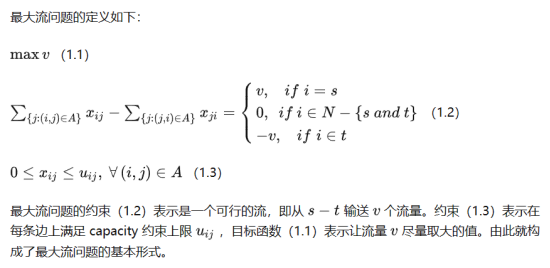

增广路径被定义为在残余网络上的一条从源点 s 到汇点 t 的简单路径，路径的残余流量为该边上的边 e' 容量的最小值，其实就是残余网络上增广的流值大于 0 的一条路径。设网络G，如果X是V的节点子集，Y是X的补集，即Y = V - X，且满足源点属于X,汇点属于Y。则称K=（X,Y）为网络G的割。最小割就是该网络中流量最小的割。

于是，数学上有最小割最大流定理：在一个网络流中，能够从源点到达汇点的最大流量等于如果从网络中移除就能够导致网络流中断的边的集合的最小容量和。即在任何网络中，最大流的值等于最小割的容量。

Ford-Fulkson的具体步骤如下：
- 初始化网络中所有边的容量，c<u,v>继承该边的容量，c<v,u>初始化为0，其中边<v,u>即为回退边。初始化最大流为0。
- 在残留网络中找一条从源S到汇T的增广路p。如能找到，则转步骤3,；如不能找到，则转步骤5。
- 在增广路p中找到所谓的"瓶颈"边，即路径中容量最小的边，记录下这个值X，并且累加到最大流中，转步骤4。
- 将增广路中所有c<u,v>减去X，所有c<v,u>加上X，构成新的残留网络。转步骤2。
- 得到最大流，退出。

另一个常见的问题是，除了限制水管的流量，还会定义每条管道上面运输自来水需要花费的费用。这个价格等于费用乘以水管上的水流量，除了要控制最大流，还需要限制花费最小，故又称最小费用最大流问题。对于这一问题Ford-Fulkson法仍然奏效，只不过开始找的增广路径就是利用Dijkstra算法求出的最短路径。
我们来看下面这个例子怎么用最大流求解：

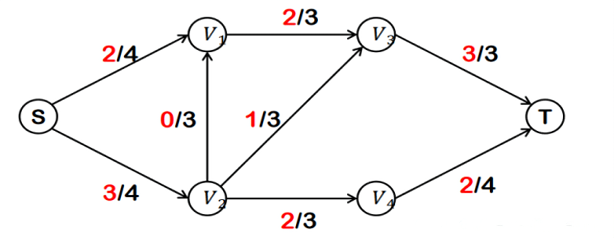

首先，找到从S到T的一条最大流量，由于总流量会存在木桶效应，路径中最小的流量决定了这条路上通过的总流量。我们把红线上的流量都-3以后添加反向边。


继续找最大的一条流量通路，同样进行增加反向边的操作。这时我们发现有两条反向边可以合并。

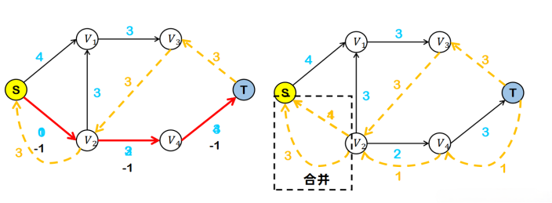

重复上述操作，此时终于产生了两个连通分量。

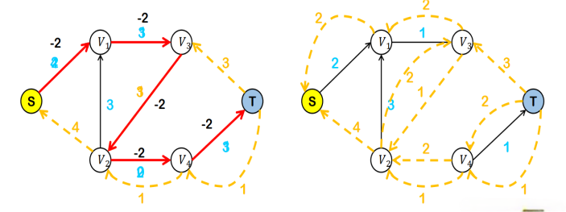

最后一次，完成。

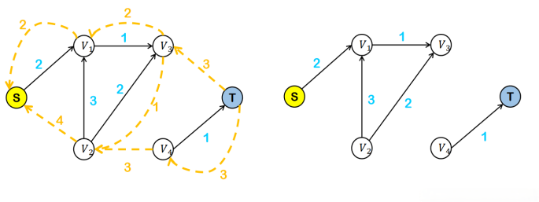

最终得到的结果如下。

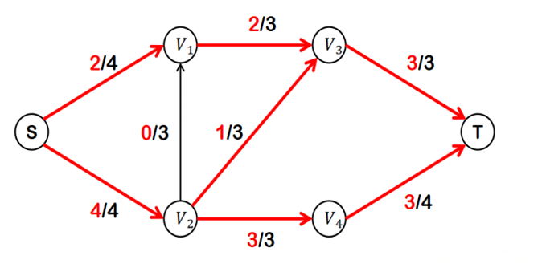


## 4.4  使用Networkx完成复杂网络建模
（本节参考自<https://zhuanlan.zhihu.com/p/536737592>，特别鸣谢！）

- 创建一个图

创建一个没有边（edge）和节点（node）的空图
```python
import networkx as nx
G = nx.Graph()
```
根据定义，图形是节点（顶点）以及已识别的节点对（称为边，链接等）的集合。在 NetworkX 中，节点可以是任何可哈希(hashable)对象，例如，文本字符串、图像、XML对象、另一个图、自定义节点对象等。python 中的None不能作为节点。
- 节点

图可以以多种形式扩张。NetworkX包括许多图生成函数和工具，用于读取和写入多种格式的图。作为简单开始，可以每次添加一个节点：
```python
G.add_node(1)
```
或者从可迭代容器(iterable)（如列表）中添加多个节点
```python
G.add_nodes_from([2, 3])
```
你也可以同时添加包含节点属性的节点，如果你的容器以(node, node_attribute_dict)2元-元组的形式
```python
G.add_nodes_from([
    (4, {"color": "red"}),
    (5, {"color": "green"}),
])
```
一个图中的节点可以合并到另一个图
```python
H = nx.path_graph(10)
G.add_nodes_from(H)
```
现在图G中节点包括原H中的节点。相反，你也可以将整个图H作为图G中的一个节点
```python
G.add_node(H)
```
现在图G 将图H作为其中一个节点。这种灵活性非常强大，因为它允许图形组成的图形，文件组成的图形，函数组成的图形等等。值得考虑如何构建应用程序，以便节点是有用的实体。当然，如果您愿意，您始终可以在G中使用唯一标识符，并按标识符键记节点信息的单独字典。

- 边

图也可以以添加一条边的形式增长
```python
G.add_edge(1, 2)
e = (2, 3)
G.add_edge(*e)  # unpack edge tuple*
```
通过接入边的列表增长
```python
G.add_edges_from([(1, 2), (1, 3)])
```
或者通过添加任何边的ebunch。ebunch 是边的元组的任何可迭代容器。边的元组可以是 2 元组节点，也可以是 3 元组：在 2 个节点后跟边的属性字典，如 (2, 3,{'weight':3.1415})。

从一个图中抽取边复制到另一个图：
```python
G.add_edges_from(H.edges)
```
一个更复杂的例子：
```python
G.add_edges_from([(1, 2), (1, 3)])
G.add_node(1)
G.add_edge(1, 2)
G.add_node("spam")        # adds node "spam"
G.add_nodes_from("spam")  # adds 4 nodes: 's', 'p', 'a', 'm'
G.add_edge(3, 'm')
```
此时，图G 包含 8 个节点和 3 条边
```python
>>> G.number_of_nodes()
8
>>> G.number_of_edges()
3
```
邻接报告(adjacency reporting)的顺序（例如，G.adj、G.successors、G.predecessors）是边添加的顺序。 然而，G.edges 的顺序是邻接的顺序，包括节点的顺序和每个节点的邻接。 请参见下面的示例：
```python
DG = nx.DiGraph()
DG.add_edge(2, 1)   # adds the nodes in order 2, 1
DG.add_edge(1, 3)
DG.add_edge(2, 4)
DG.add_edge(1, 2)
assert list(DG.successors(2)) == [1, 4]
assert list(DG.edges) == [(2, 1), (2, 4), (1, 3), (1, 2)]
```
- 检查图的元素

我们可以检查节点和边。 四个基本图形属性便于报告：G.nodes、G.edges、G.adj 和 G.degree。 这些是图中节点、边、邻居（邻接）和节点度数的集合视图。 它们为图形结构提供了一个不断更新的只读视图。 它们也类似于 dict，因为您可以通过视图查找节点和边缘数据属性，并使用方法 .items()、.data() 迭代数据属性。 如果你想要一个特定的容器类型而不是一个视图，你可以指定一个。 这里我们使用列表，尽管集合、字典、元组和其他容器在其他情况下可能会更好。
```python
>>> list(G.nodes)
[1, 2, 3, 'spam', 's', 'p', 'a', 'm']
>>> list(G.edges)
[(1, 2), (1, 3), (3, 'm')]
>>> list(G.adj[1])  # or list(G.neighbors(1))
[2, 3]
>>> G.degree[1]  # the number of edges incident to 1
2
```
可以指定使用 nbunch 报告来自所有节点子集的边缘和度数。 nbunch 是以下任何一种：None（表示所有节点）；单个节点或节点的可迭代容器；其本身不是图中的节点。
```python
>>> G.edges([2, 'm'])
EdgeDataView([(2, 1), ('m', 3)])
>>> G.degree([2, 3])
DegreeView({2: 1, 3: 2})
```
- 从图中删除元素

可以以添加元素相同的风格山下湖边和节点。使用 Graph.remove_node(), Graph.remove_nodes_from(), Graph.remove_edge() 和 Graph.remove_edges_from(), 等方法
```python
>>> G.remove_node(2)
>>> G.remove_nodes_from("spam")
>>> list(G.nodes)
[1, 3, 'spam']
>>> G.remove_edge(1, 3)
```
- 使用图构造函数

图形对象不是只能增量构建 - 指定图形结构的数据可以直接传递给各种图形类的构造函数。 通过实例化其中一个图形类来创建图形结构时，您可以指定多种格式的数据。
```python
>>> G.add_edge(1, 2)
>>> H = nx.DiGraph(G)  # create a DiGraph using the connections from G
>>> list(H.edges())[(1, 2), (2, 1)]
>>> edgelist = [(0, 1), (1, 2), (2, 3)]
>>> H = nx.Graph(edgelist)  # create a graph from an edge list
>>> list(H.edges())[(0, 1), (1, 2), (2, 3)]
>>> adjacency_dict = {0: (1, 2), 1: (0, 2), 2: (0, 1)}
>>> H = nx.Graph(adjacency_dict)  # create a Graph dict mapping nodes to nbrs
>>> list(H.edges())[(0, 1), (0, 2), (1, 2)]
```
- 访问边缘和邻居

除了视图 Graph.edges 和 Graph.adj 之外，还可以使用下标表示法访问边和邻居。
```python
>>> G = nx.Graph([(1, 2, {"color": "yellow"})])
>>> G[1]  # same as G.adj[1]
AtlasView({2: {'color': 'yellow'}})
>>> G[1][2]
{'color': 'yellow'}
>>> G.edges[1, 2]
```
如果边缘已经存在，您可以使用下标表示法获取/设置边缘的属性。
```
>>> G.add_edge(1, 3)
>>> G[1][3]['color'] = "blue"
>>> G.edges[1, 2]['color'] = "red"
>>> G.edges[1, 2]
{'color': 'red'}
```
使用 G.adjacency() 或 G.adj.items() 可以快速检查所有（节点、邻接）对。 请注意，对于无向图，邻接迭代会看到每条边两次。
```python
FG = nx.Graph()
FG.add_weighted_edges_from([(1, 2, 0.125), (1, 3, 0.75), (2, 4, 1.2), (3, 4, 0.375)])
for n, nbrs in FG.adj.items():
   for nbr, eattr in nbrs.items():
       wt = eattr['weight']
       if wt < 0.5: print(f"({n}, {nbr}, {wt:.3})")
使用edges 属性可以方便地访问所有边缘
for (u, v, wt) in FG.edges.data('weight'):
    if wt < 0.5:
        print(f"({u}, {v}, {wt:.3})")
```
- 向图、节点和边添加属性

诸如权重、标签、颜色或任何您喜欢的 Python 对象之类的属性都可以附加到图形、节点或边上。

每个图、节点和边都可以在关联的属性字典中保存键/值属性对（键必须是可散列的）。 默认情况下，这些是空的，但可以使用 add_edge、add_node 或直接操作名为 G.graph、G.nodes 和 G.edges 的属性字典来添加或更改属性。

创建新图形时分配图形属性
```python
>>> G = nx.Graph(day="Friday")
>>> G.graph
{'day': 'Friday'}
```
或者您可以稍后修改属性
```python
>>> G.graph['day'] = "Monday"
>>> G.graph
{'day': 'Monday'}
```

使用 add_node(), add_nodes_from(), or G.nodes 添加节点属性
```python
>>> G.add_node(1, time='5pm')
>>> G.add_nodes_from([3], time='2pm')
>>> G.nodes[1]
{'time': '5pm'}
>>> G.nodes[1]['room'] = 714
>>> G.nodes.data()
NodeDataView({1: {'time': '5pm', 'room': 714}, 3: {'time': '2pm'}})
```
请注意，将节点添加到 G.nodes 不会将其添加到图中，请使用 G.add_node() 添加新节点。 对于边缘也是如此。

使用 add_edge()、add_edges_from() 或下标表示法添加/更改边缘属性。
```python
G.add_edge(1, 2, weight=4.7 )
G.add_edges_from([(3, 4), (4, 5)], color='red')
G.add_edges_from([(1, 2, {'color': 'blue'}), (2, 3, {'weight': 8})])
G[1][2]['weight'] = 4.7
G.edges[3, 4]['weight'] = 4.2
```
特殊属性权重( weight)应该是数字，因为它被需要加权边缘的算法使用。
- 有向图

DiGraph 类提供了特定于有向边的附加方法和属性，例如，DiGraph.out_edges、DiGraph.in_degree、DiGraph.predecessors、DiGraph.successors 等。为了让算法轻松地使用这两个类，有向版本的 neighbors等效于 successors ，而 degree 报告 是 in_degree 和 out_degree 的总和，即使有时可能感觉不一致。
```python
>>> DG = nx.DiGraph()
>>> DG.add_weighted_edges_from([(1, 2, 0.5), (3, 1, 0.75)])
>>> DG.out_degree(1, weight='weight')
0.5
>>> DG.degree(1, weight='weight')
1.25
>>> list(DG.successors(1))
[2]
>>> list(DG.neighbors(1))
[2]
```
一些算法仅适用于有向图，而另一些算法对有向图没有很好的定义。 事实上，将有向图和无向图混为一谈的趋势是危险的。 如果您想将有向图视为无向的某些测量，您可能应该使用Graph.to_undirected()或使用H = nx.Graph(G)获得无向图版本

- 多图

NetworkX 提供了允许任意一对节点之间存在多条边的图类。 MultiGraph 和 MultiDiGraph 类允许您添加相同的边两次，可能使用不同的边数据。 这对于某些应用程序来说可能很强大，但许多算法在此类图上没有很好地定义。 在结果定义明确的地方，例如 MultiGraph.degree() 我们提供了函数。 否则，您应该以使测量明确定义的方式转换为标准图表。
```python
>>> MG = nx.MultiGraph()
>>> MG.add_weighted_edges_from([(1, 2, 0.5), (1, 2, 0.75), (2, 3, 0.5)])
>>> dict(MG.degree(weight='weight'))
{1: 1.25, 2: 1.75, 3: 0.5}
>>> GG = nx.Graph()
>>> for n, nbrs in MG.adjacency():
       for nbr, edict in nbrs.items():
           minvalue = min([d['weight'] for d in edict.values()])
           GG.add_edge(n, nbr, weight = minvalue)

>>> nx.shortest_path(GG, 1, 3)
[1, 2, 3]
```
- 图生成器和图操作

除了逐节点或逐边构造图之外，它们还可以通过以下方式生成
1. 应用经典的图操作，例如：
---
| 方法                              | 介绍                                                         |
| --------------------------------- | ------------------------------------------------------------ |
| subgraph(G, nbunch)               | Returns the subgraph induced on nodes in nbunch.             |
| union(G, H[, rename, name])       | Return the union of graphs G and H.                          |
| disjoint_union(G, H)              | Return the disjoint union of graphs G and H.                 |
| cartesian_product(G, H)           | Returns the Cartesian product of G and H.                    |
| compose(G, H)                     | Returns a new graph of G composed with H.                    |
| complement(G)                     | Returns the graph complement of G.                           |
| create_empty_copy(G[, with_data]) | Returns a copy of the graph G with all of the edges removed. |
| to_undirected(graph)              | Returns an undirected view of the graph graph.               |
| to_directed(graph)                | Returns a directed view of the graph graph.  |
---
2. 对经典小图进行调用
---
| 方法                                 | 介绍                                              |
| ------------------------------------ | ------------------------------------------------- |
| petersen_graph([create_using])       | Returns the Petersen graph.                       |
| tutte_graph([create_using])          | Returns the Tutte graph.                          |
| sedgewick_maze_graph([create_using]) | Return a small maze with a cycle.                 |
| tetrahedral_graph([create_using])    | Returns the 3-regular Platonic Tetrahedral graph. |
---
3. 为经典图使用（constructive）生成器
---
| 方法                                             | 介绍                                                         |
| ------------------------------------------------ | ------------------------------------------------------------ |
| complete_graph(n[, create_using])                | Return the complete graph K_n with n nodes.                  |
| complete_bipartite_graph(n1, n2[, create_using]) | Returns the complete bipartite graph K_{n_1,n_2}.            |
| barbell_graph(m1, m2[, create_using])            | Returns the Barbell Graph: two complete graphs connected by a path. |
| lollipop_graph(m, n[, create_using])             | Returns the Lollipop Graph; K_m connected to P_n.            |

---
像这样
```python
K_5 = nx.complete_graph(5)
K_3_5 = nx.complete_bipartite_graph(3, 5)
barbell = nx.barbell_graph(10, 10)
lollipop = nx.lollipop_graph(10, 20)
```
4. 使用随机图生成器，
---
| 方法                                      | 介绍                                                         |
| ----------------------------------------- | ------------------------------------------------------------ |
| erdos_renyi_graph(n, p[, seed, directed]) | Returns a Gn,p random graph, also known as an Erdős-Rényi graph or a binomial graph. |
| watts_strogatz_graph(n, k, p[, seed])     | Returns a Watts–Strogatz small-world graph.                  |
| barabasi_albert_graph(n, m[, seed, ...])  | Returns a random graph using Barabási–Albert preferential attachment |
| random_lobster(n, p1, p2[, seed])         | Returns a random lobster graph.                              |
---
像这样
```python
er = nx.erdos_renyi_graph(100, 0.15)
ws = nx.watts_strogatz_graph(30, 3, 0.1)
ba = nx.barabasi_albert_graph(100, 5)
red = nx.random_lobster(100, 0.9, 0.9)
```
5. 使用常用图形格式读取存储在文件中的图形
NetworkX 支持许多流行的格式，例如边缘列表、邻接列表、GML、GraphML、pickle、LEDA 等。
```python
nx.write_gml(red, "path.to.file")
mygraph = nx.read_gml("path.to.file")
```
有关图形格式的详细信息，请参阅读和写图形；有关图形生成器函数，请参阅图形生成器

- 分析图
可以使用各种图论函数来分析图G 的结构，例如：
```python
>>> G = nx.Graph()
>>> G.add_edges_from([(1, 2), (1, 3)])
>>> G.add_node("spam")       # adds node "spam"
>>> list(nx.connected_components(G))
[{1, 2, 3}, {'spam'}]
>>> sorted(d for n, d in G.degree())
[0, 1, 1, 2]
>>> nx.clustering(G)
{1: 0, 2: 0, 3: 0, 'spam': 0}
```
一些具有大输出的函数迭代 (node, value) 2 元组。 如果您愿意，这些很容易存储在 dict 结构中。
```python
>>> sp = dict(nx.all_pairs_shortest_path(G))
>>> sp[3]
{3: [3], 1: [3, 1], 2: [3, 1, 2]}
```

- 绘制图

NetworkX 主要不是一个图形绘图包，而是包含使用 Matplotlib 的基本绘图以及使用开源 Graphviz 软件包的接口。 这些是 networkx.drawing 模块的一部分，如果可能，将被导入。

首先导入 Matplotlib 的绘图接口（pylab 也可以）
```python
import matplotlib.pyplot as plt
要测试 nx_pylab 是否成功导入，请使用以下方法之一绘制图G
G = nx.petersen_graph()
subax1 = plt.subplot(121)
nx.draw(G, with_labels=True, font_weight='bold')
subax2 = plt.subplot(122)
nx.draw_shell(G, nlist=[range(5, 10), range(5)], with_labels=True, font_weight='bold')
```
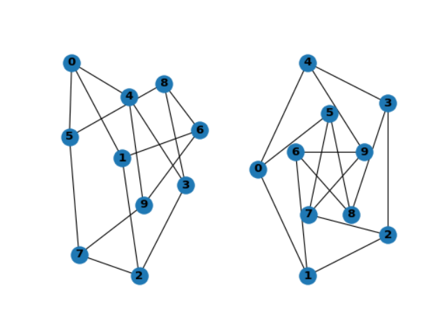
交互式操作时上述图像会自动展示。 请注意如果您没有在交互模式下使用 matplotlib，您可能需要下面命令展示图形
```python
plt.show()  

options = {
    'node_color': 'black',
    'node_size': 100,
    'width': 3,
}
subax1 = plt.subplot(221)
nx.draw_random(G, **options)
subax2 = plt.subplot(222)
nx.draw_circular(G, **options)
subax3 = plt.subplot(223)
nx.draw_spectral(G, **options)
subax4 = plt.subplot(224)
nx.draw_shell(G, nlist=[range(5,10), range(5)], **options)
```

您可以通过 draw_networkx() 找到其他选项，并通过布局模块找到布局。 您可以通过 draw_shell() 使用多个 shell。
```python
G = nx.dodecahedral_graph()
shells = [[2, 3, 4, 5, 6], [8, 1, 0, 19, 18, 17, 16, 15, 14, 7], [9, 10, 11, 12, 13]]
nx.draw_shell(G, nlist=shells, **options)

```

要将图形保存到文件中，请使用，例如
```python
nx.draw(G)
plt.savefig("path.png")
```
此函数写入本地目录中的文件 path.png。 如果 Graphviz 和 PyGraphviz 或 pydot 在您的系统上可用，您还可以使用 networkx.drawing.nx_agraph.graphviz_layout 或 networkx.drawing.nx_pydot.graphviz_layout 来获取节点位置，或者以点格式编写图形以进行进一步处理。
有关其他详细信息，请参见绘图。

## 4.5  图论算法：TSP问题与VRP问题
TSP问题与VRP问题都是优化问题中的经典难题，它们在现实生活中有着重要的应用。TSP问题，也就是旅行商问题，可以简单理解为一个旅行家要访问多个城市，并且希望找到一条最短的路径来依次访问每个城市并最终回到出发地。这个问题看起来简单，但随着城市数量的增加，求解的难度会急剧上升。

而VRP问题，即车辆路径规划问题，则更加贴近我们的日常生活。它主要解决的是如何安排一组车辆，在满足各种约束条件（如货物需求、时间限制、车辆容量等）的前提下，以最小的成本或距离完成货物的配送任务。这就像是物流公司要规划送货路线，既要保证货物能准时送达，又要考虑成本效益。

这两个问题虽然看似不同，但它们的本质都是寻找最优解，即在满足一定条件的前提下，找到最符合目标要求的方案。无论是TSP问题还是VRP问题，都需要我们运用数学、计算机等学科知识，通过算法和模型来求解。在解决这些问题的过程中，我们不仅可以锻炼自己的逻辑思维和解决问题的能力，还可以为现实生活中的许多问题提供有效的解决方案。

TSP问题的背景源自一个古老的问题，即旅行商难题：假设有一个旅行商人要拜访n个城市，他必须选择所要走的路径，路径的限制是每个城市只能拜访一次，而且最后要回到原来出发的城市。路径的选择目标是要求得的路径路程为所有路径之中的最小值。

TSP问题是图论领域一个典型的NP难问题，目前进展迅速的想法是使用以进化计算与群体智能方法为代表的启发式方法求解精确解或者近似解。

利用动态规划解网络TSP的核心想法就是分支，当我从起点开始可以直达多个其他节点时，对于某一条边，添加到回路圈和不添加到回路圈会对子问题产生怎样的影响。如果添加这一条边，剩下的子问题最短回路会是多长；不添加的话子问题的最短回路又是多长呢？
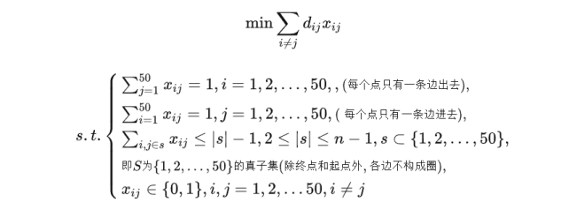

车辆路径问题最早由Dantzig和Ramser于1959年首次提出，是运筹学中一个经典问题。VRP问题主要研究物流配送中的车辆路径规划问题，是当今物流行业中的基础问题。在VRP问题中，假设有一个供求关系系统，车辆从仓库取货，配送到若干个顾客处。车辆受到载重量的约束，需要组织适当的行车路线，在顾客的需求得到满足的基础上，使代价函数最小。

代价函数根据问题不同而不同，常见的有车辆总运行时间最小，车辆总运行路径最短等。基本的问题形式为：假设有N辆车，都从原点出发，每辆车访问一些点后回到原点，要求所有的点都要被访问到，求最短的车辆行驶距离或最少需要的车辆数。

在VRP问题中，假设有一个供求关系系统，车辆从仓库取货，配送到若干个顾客处。车辆受到载重量的约束，需要组织适当的行车路线，在顾客的需求得到满足的基础上，使代价函数最小。代价函数根据问题不同而不同，常见的有车辆总运行时间最小，车辆总运行路径最短等。

假设现在有多辆运载车运输医疗物资到医院，行驶能力、速度、续航等相同。定义j,k为需要接收物资的医院，e为车辆编号，C为城市的集合。Djk为从j到k的行驶距离，dj为医院j的缺口需求量，而车辆的最大载重量为Ye。可以列出如下优化模型：
$$
\begin{array}{c}
\min \sum\limits_{e \in E} {\sum\limits_{j \in C} {\sum\limits_{k \in C} {{D_{jk}}} } } {z_{ejk}}\\
s.t.\left\{ \begin{array}{l}
\sum\limits_{e \in E} {\sum\limits_{j \in C} {{z_{ejk}}} }  = 1,\forall j,k \in C\backslash \{ 0\} \\
\sum\limits_{j \in C\backslash \{ 0\} } {\sum\limits_{k \in C\backslash \{ 0\} }^k {{d_k}{z_{ejk}}} }  \le {Y_e},\forall i,e \in E\\
\sum\limits_{j \in C} {{z_{e0k}}}  = 1,\forall e \in E\\
\sum\limits_{j \in C\backslash \{ 0\} } {{z_{ejk}}}  - \sum\limits_{k \in C\backslash \{ 0\} }^k {{z_{ejk}}}  = 0,\forall e \in E\\
\sum\limits_{j \in {C_i}} {{z_{ejk}}}  = 1,\forall e \in E\\
{z_{ejk}} \in \{ 0,1\} ,\forall e \in E,\forall j,k \in C
\end{array} \right.
\end{array}
$$

本质上这一模型优化的是每辆车在各自回路上的路程和运载量乘积的和。用z表示复杂网络上节点j到节点k的路径上车辆e是否运送。本质上这一个成分是离散优化。然后，每一个医院都得有一辆车送；每一辆车送的量不能超载；每辆车最后必须返回配送中心。决策变量z是0-1变量，但是规模较大，所以与TSP类似，它也是用启发式算法解居多。
除此以外，还存在多仓库VRP等多种问题：

- 基本VRP


- 容量限制VRP


- 时间窗VRP

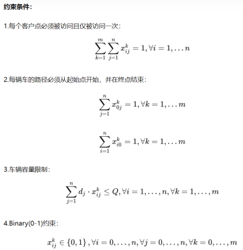

- 混合VRP: 允许不同类型的车辆存在，每种类型的车辆有不同的容量和成本，目标是最小化总成本。HVRP的主要特点在于它允许在同一个问题中考虑多种不同类型的车辆，这些车辆可以有不同的容量、速度、成本等属性。因此，在解决HVRP时，需要考虑以下几个方面：
    - 车辆类型： 不同类型的车辆可能有不同的特点，如不同的容量限制、速度和成本。这些属性需要在问题中明确指定。
    - 客户点需求： 每个客户点可能需要不同数量的货物，而不同类型的车辆可以承载不同数量的货物。因此，需要确保分配到每个客户点的车辆类型满足其需求。
    - 成本和效率： 由于不同类型的车辆有不同的成本和速度，需要综合考虑成本和效率来优化路线分配。
    - 路径优化： 在HVRP中，需要找到一种分配方案，使得每个客户点都得到服务，同时最小化总行驶距离或成本。涉及到路径规划和车辆调度的问题。

- 多目标VRP: 考虑多个冲突的目标，如最小化总行驶距离和最小化总成本。多目标车辆路径问题（Multi-Objective Vehicle Routing Problem，MOVRP）是车辆路径问题的一种变体，其主要特点是在优化过程中考虑多个目标函数，而不仅仅是单一的目标。MOVRP涉及在满足车辆容量和其他约束条件的前提下，同时优化多个不同的目标，如最小化总行驶距离、最小化总成本、最小化车辆数量等。MOVRP的主要挑战在于寻找一种解决方案，能够在多个不同目标之间找到一个平衡，并得到一组最优或非劣解（Pareto最优解）。这些解代表了在多个目标之间的权衡选择，没有一个解在所有目标上都优于其他解。

**例4.1** 无人机和车辆都可以一次运输多个地点，但在无人机电量耗尽之前二者必须在同一地点会合让无人机更换电池和重新装载物资。配送车辆和无人机合作完成所有地点应急物资配送任务，返回到出发地点，此时称为完成一次整体配送。

而在整体配送任务中配送时间是主要的研究因素。按照配送车辆和无人机从出发开始至全部返回到出发地点的时间来计算。在配送过程中，不考虑配送车辆及无人机装卸物资的时间，同时不考虑配送车辆和无人机在各个配送点的停留时间。各个节点的物资需求量如表4.1所示。图给出了问题的网络示意图。

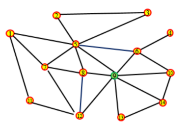


1. 图中给出了所有地点的连接关系网络，仅考虑邻接矩阵中黑色的项。若目前所有应急物资集中在地点9，唯一的配送车辆的最大载重量为1000千克，采取仅使用配送车辆建立完成一次整体配送的数学模型，并给出最优方案。
2. 在问题一的基础上增加了无人机专用路线，如红色所示。应急物资仍然集中在第9个地点，配送车辆的最大载重量为 1000 千克，采取“配送车辆+无人机”的配送模式。建立完成一次整体配送的数学模型，并给出最优方案。

| **节点**   | **1** | **2** | **3**  | **4**  | **5**  | **6**  | **7**  |
| ---------- | ----- | ----- | ------ | ------ | ------ | ------ | ------ |
| **需求量** | 12    | 90    | 24     | 15     | 70     | 18     | 150    |
| **节点**   | **8** | **9** | **10** | **11** | **12** | **13** | **14** |
| **需求量** | 50    | 30    | 168    | 36     | 44     | 42     | 13     |

我这里给出我的一些思考：

由于问题一中所有节点的需求量之和小于1000，故暂时不需要考虑负载问题。对于这一VRP问题，我们将其抽象为一个0-1规划问题求解。决策变量为节点i与节点j之间的路径是否经过，若经过则变量取值为1，不经过则变量取值为0。决策目标为使得总路径最短，那么，问题可以抽象为：
	(4.2)
而对于无法直接到达的节点对，我们定义其距离为无穷大，这时对应的x必须取0。问题被抽象为一个0-1规划问题。可以使用0-1规划函数求解，但我更建议用遗传算法或模拟退火算法做这个问题，如果一头雾水可以参考第九章。解得结果路径如图所示：

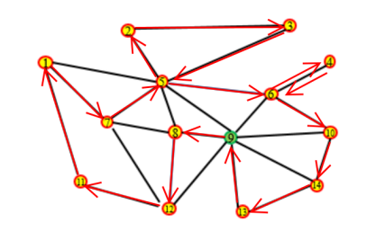

利用遗传算法计算得到配送车经过的总路径为582km，配送车花费的最短总时长为11.64h，综合分析，模型求解时间仅需27s，在保证速度较快的同时我们也以枚举的方法列出了所有的可能，发现确实是最优解，说明使用启发式方法对于这一规模下的VRP问题求解是完备的，模型应用初步成功。

问题二在问题一的基础上增加了无人机，也新增了仅有无人机能行动的路径。如图5所示，虚线为仅有无人机能运行的路径。

经过路径增广以后我们通过计算问题一和问题二中节点的平均度数和聚类系数，发现问题二形成的增广网络在拓扑结构上更具有稳定性，节点度也更高，使得节点形成TSP形式下的回路是可行的。其中，节点5度数为7，节点9度数为7，节点8度数为5，节点6度数也为5，是需要注意的四个节点。

在问题一的基础上我们引入无人机的矩阵y，使得：


这里我们没有再选择路径为优化目标，而是换用时间为优化目标。因为总路径最短并不一定能保证时间最短。若对于某一段子路径，配送车和无人机都在节点i出发，在节点k会合，那么这一段的时间优化为：


在这一段子路径中，无人机和配送车除了起点和终点没有共有节点，需要使得它们的经过时间取更大的一方。而对于对应的路径，我们即取对应子路径u,v及其对应的0-1决策变量x,y，使得：


那么决策目标是所有子路径的最优时间求和。即：


其中N为所有子路径划分的会合点集。

而在问题中两个小于的约束条件无法保证每个节点都能运送到。为了保证这一点，我们引入两个14维的0-1向量，表示节点由无人机配送还是由车辆配送。这两个向量满足条件：


除此以外，向量P还需要满足负载条件，但我们已经知道车载负载是一定可以满足的，于是考虑无人机在每个子路径上的负载条件：


于是，我们建立起了一个较为完备的带约束的优化模型。对于这一模型，约束条件过多且有两个对象，所以在变量编码过程中需要重新进行约束，所需要的变量量也是原有的两倍以上。对于这一问题，使用遗传算法的求解将远远优于传统优化。

同样利用群智能算法可以解得结果如图所示：


得到总策略为：车辆的行进路程为315，无人机的行进路程为295。时间由于车辆运动时间更长一些，所以就着车子的来，就是4.3h最优。
